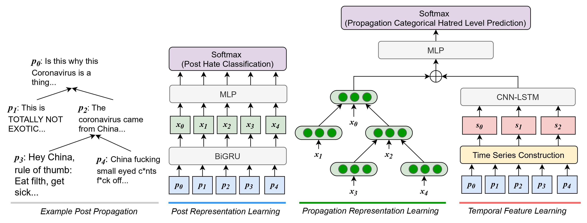

# Early Prediction of Hate Speech Propagation
Code for IAAA 2021 Paper: "Early Prediction of Hate Speech Propagation" <p>

</p>

## Data
The construction of our datasets and their corresponding data source is provided in the paper. According to Twitter's policy we cannot share the data content. Intead, sample data for running simple test is provided.

## Our model:HEAR
The PyTorch implementation of our model is provided in `implementation/model.py`, you can run the model with provided sample data by running:
```
python main.py
```

## Citation
If you find this paper useful, please cite following reference:
```
  @article{hear,
  title={Early Prediction of Hate Speech Propagation},
  author={Lin, Ken-Yu and Lee, Roy Ka-Wei and Gao, Wei and Peng, Wen-Chih}
  journal={International Workshop on Intelligence-Augmented Anomaly Analytics},
  year={2021}
}
```
